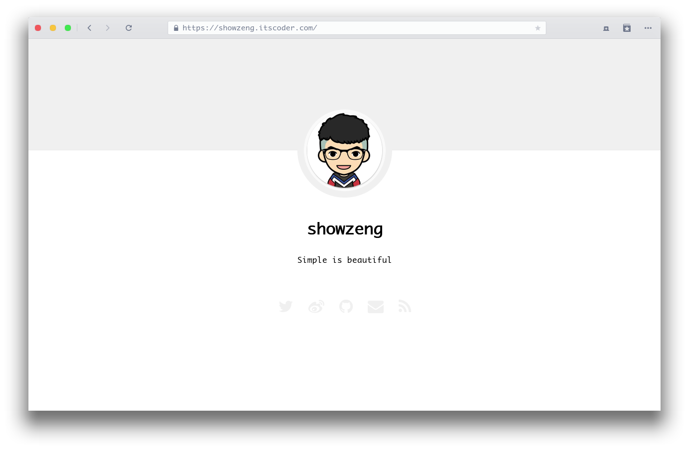

# Minimalism

Minimalism 是一款基于 Jekyll 为极简主义者打造的极简主题。

## License

The theme is available as open source under the terms of the [MIT License](https://opensource.org/licenses/MIT).

[blog]: https://showzeng.itscoder.com
[demo]: https://showzeng.github.io
[license]: https://creativecommons.org/licenses/by-nc-nd/4.0/
[wiki]: https://github.com/showzeng/Minimalism/wiki
[issue]: https://github.com/showzeng/Minimalism/issues/new
[Change Log]: https://github.com/showzeng/Minimalism/wiki/Change-Log
[HenCoder]: https://hencoder.com/
[Jaeger]: https://jaeger.itscoder.com/
